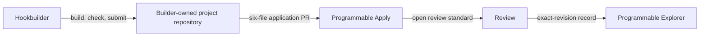

<p align="center">
  
</p>

<h1 align="center">Programmable Apply</h1>

<p align="center">
  Public applications, open review rules and the discovery ledger for Programmable projects.
</p>

The Registry gives agents, reviewers, and the Programmable Explorer one GitHub-backed source for what has been
submitted, reviewed, deployed, made available, suspended, or retired. It never turns a local check, merged application,
similarity match, deployment, or indexer observation into a safety guarantee.

## Build, apply, review



- The builder's repository owns the complete project.
- [`hookbuilder`](https://github.com/0xprogrammable/hookbuilder) owns agent behavior, rules,
  templates, checks, and the GitHub client.
- This repository owns applications and discovery records.
- [`programmable`](https://github.com/0xprogrammable/programmable) owns the platform, contracts, and Explorer.

## Open review standard

The selection rules are public. They judge exact evidence, not whether an idea is familiar, fashionable or profitable.
Unknown platform-owned behavior stays pending; it is not silently called unsafe. A hard block requires a complete,
revision-bound and independently replayed witness.

Read the [Open Review Standard](docs/OPEN_REVIEW_STANDARD.md), inspect the
[policy](review/policy.v1.json), or run a public example:

```bash
npm run review -- review/examples/disclosed-high-fee.json
```

The local result never signs an approval or grants launch rights.

## Current registry

[`registry/index.json`](registry/index.json) is the small discovery entry point. Every entry binds one closed record by
SHA-256. [`registry/search-index.json`](registry/search-index.json) contains only bounded discovery metadata; agents
fetch a full project record only after a match.

Statuses are deliberately separate: `design`, `candidate`, `accepted`, `deployed`, `available`, `suspended`, and
`retired`. Pending pull requests are unreviewed applications and are never inserted into the canonical registry merely
because their intake check passed.

Read the small contracts before integrating:

- [Architecture and trust boundaries](docs/ARCHITECTURE.md)
- [Discovery contract](docs/DISCOVERY_CONTRACT.md)
- [Review and promotion lifecycle](docs/REVIEW_LIFECYCLE.md)
- [Legacy intake migration](docs/MIGRATION.md)
- [Current code-maturity assessment](docs/CODE_MATURITY.md)
- [Open Review Standard](docs/OPEN_REVIEW_STANDARD.md)

## Apply

Use the released [Hookbuilder](https://github.com/0xprogrammable/hookbuilder). Your complete project stays in your own public GitHub repository. After exact
confirmation, the Builder opens a draft pull request containing exactly six generated files under
`submissions/<application-id>/`.

The Registry is in migration prelaunch until the matching Builder release activates this target. Existing applications
already opened against `0xprogrammable/programmable` keep their original review thread.

## Verify

Node.js 20 or newer is required. The repository has no runtime dependencies.

```bash
npm test
```

Application content is untrusted data. The `pull_request_target` intake job checks out only protected base code, uses
read-only permissions, hydrates only the bounded six-file package, and never executes candidate code.

## Security and independence

Read [SECURITY.md](SECURITY.md) before reporting a vulnerability. Programmable Registry is independent open-source
software. It does not claim affiliation with or endorsement by Uniswap Labs or Uniswap Foundation.
