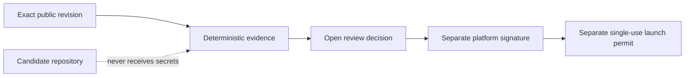

# Open Review Standard v1

Programmable reviews exact project revisions. It does not rank ideas, judge whether a project is interesting, or reject
unusual tokenomics merely because they are unusual.

The public standard defines five decision-critical axes. A prepared review input records the evidence state for each
axis:

1. **Artifact identity** binds the repository, commit, tree, configuration and executable artifact.
2. **Functionality** checks that declared paths actually execute, including failure, recovery and no-market behavior.
3. **Disclosure** checks that fees, losses, authority, custody, exits and external dependencies are stated before consent.
4. **Integrity** reconciles value and authority effects against those disclosures.
5. **Launch compatibility** checks the separate technical requirements for a Programmable launch.

Advisories are separate. Novelty, complexity, profitability, popularity, a high disclosed fee, an intentional disclosed
loss, a no-market design, or an unfamiliar architecture is not by itself a blocker.



The public checker ends at the unsigned review decision. It has no production credentials and cannot sign or issue a
launch permit. It validates a closed review input and applies the published policy; it does not fetch project
repositories, run project tests, or independently reproduce the supplied evidence.

## Decisions

| Status | Meaning |
| --- | --- |
| `launch_ready` | Every decision-critical axis is closed for the exact revision. This local result still does not authorize a launch. |
| `changes_requested` | Candidate-owned evidence or implementation is missing or contradicted. |
| `platform_analysis_pending` | Platform-owned replay, tooling or external evidence is still missing. Unknown does not mean unsafe. |
| `blocked_proven_integrity_failure` | A supported universal failure has a complete, revision-bound and independently replayed witness. |
| `changed_since_review` | The current repository, tree or configuration no longer matches the reviewed revision. |

Only `UNAUTHORIZED_VALUE_DIVERSION` has an automated hard-block replay class in v1. Five additional universal rule
classes are published in [`review/policy.v1.json`](../review/policy.v1.json), but they remain pending until their dedicated
replay semantics exist. A model opinion, scanner score, label or incomplete witness cannot hard-block a project.

## Run the public checker

Node.js 22 or newer is sufficient. The checker has no runtime dependencies and never executes a candidate repository.

```bash
npm run review -- review/examples/disclosed-high-fee.json
```

The output is deterministic and hash-bound. It is an unsigned local preview with `checkerOnly: true`,
`launchAuthorized: false` and `independentAudit: false`.

The input and decision formats are public:

- [`open-review-input.v1.schema.json`](../review/schemas/open-review-input.v1.schema.json)
- [`open-review-decision.v1.schema.json`](../review/schemas/open-review-decision.v1.schema.json)

## Hard-block proof

A hard block requires all of the following:

- the exact repository, commit, tree and configuration;
- a reachable transaction or state sequence;
- affected actors and value;
- the violated property;
- a deterministic reproduction;
- an independent replay; and
- a complete witness supported by the current policy version.

Suspicion is not proof. An incomplete witness remains pending. A new revision receives a new review.

## Authority boundary

This repository publishes the standard, schemas, deterministic preview engine, examples and public application ledger.
Production signing keys, credentials, isolated runners, hidden mutation corpora and launch-permit authority are not
public application data. A signed platform decision and a later launch permit are separate steps.
